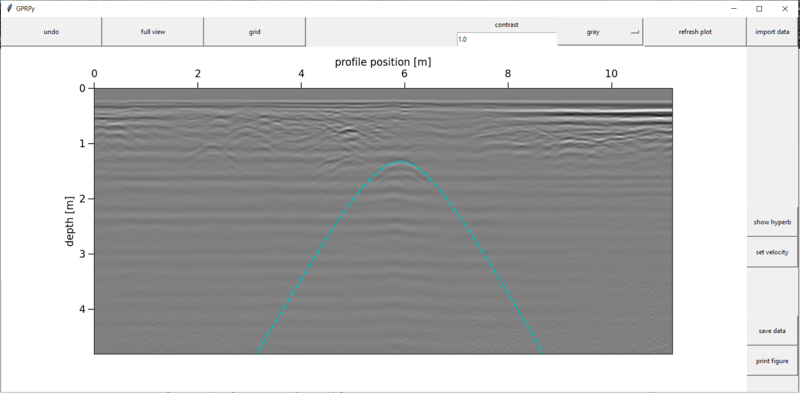

# GPRPyMini

This mini version GPRPy focuses on estimating a single ground velocity by interactively fitting hyperbolas to diffraction patterns in the data.

## Simplemost installation

**In the following instructions, if you use Windows, use the comands `python` and `pip`. If you use Mac or Linux, use the commands `python3` and `pip3` instead.**

1) Download the GPRPyMini software from 
   [https://github.com/ChMaDowns/GPRPyMini/archive/master.zip](https://github.com/ChMaDowns/GPRPyMini/archive/master.zip).  
   Save the file somewhere on your computer and extract the zip folder.  
   As an **alternative**, you can install git from [https://git-scm.com/](https://git-scm.com/), then run in a command prompt: 
   `git clone https://github.com/ChMaDowns/GPRPyMini.git` 
   The advantage of the latter is that you can easily update your software by running from the GPRPyMini folder in a command prompt: 
   `git pull origin master`

2) Install Python 3.7 for example from [https://conda.io/miniconda.html](https://conda.io/miniconda.html)

3) Once the installation finished, open a command prompt that can run Python  
   On Windows: click on Start, then enter "Anaconda Prompt", without the quotation marks into the "Search programs and files" field. On Mac or Linux, open the regular terminal.

4) In the command prompt, change to the directory  where you downloaded the GPRPy files.
   This is usually through a command like for example 
   `cd Desktop\GPRPyMini` 
   if you downloaded GPRPyMini directly onto your desktop. Then type the following and press enter afterward: 
   `python installMigration.py` 
   Then type the following and press enter afterward: 
   `pip install .` 
   **don't forget the period "." at the end of the `pip install` command**

## Running the software
After installation, you can run the script from the Anaconda Prompt (or your Python-enabled prompt) by running either 
`gprpy` 
or 
`python -m gprpy`

## In case of trouble
If you have several versions of python installed, for example on a Mac or Linux system, replace, in the commands shown earlier,
`python` with `python3` 
and 
`pip` with `pip3`

If you have any troubles getting the software running, please send me an email or open an issue on GitHub and I will help you getting it running.

## Uninstalling GPRPyMini
To uninstall GPRPyMini, simply run, in the (Anaconda) command prompt 
`pip uninstall gprpy`

## News
Follow [@GPRPySoftware](https://twitter.com/GPRPySoftware) on twitter to hear about news and updates on the full version.

## Original Funding
Open-source Ground Penetrating Radar processing and visualization software. Supported by the National Science Foundation under grant [EAR-1550732](https://www.nsf.gov/awardsearch/showAward?AWD_ID=1550732).
